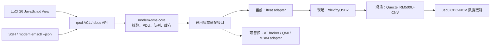

# ZX7981PD LuCI 短信中心 PRD

版本：1.6（r6 已验收基线与 r7 Stage A 边界）

日期：2026-07-31

## 1. 产品目标

在 ZX7981PD 的 OpenWrt 25.12/LuCI 26 上提供安全、可靠的通用短信收发能力，同时不破坏现有 5G 数据连接，不让 LuCI 直接接触串口或执行任意 AT 命令。

成功标准：管理员可在 LuCI 中读取、拼接显示和发送短信；普通点对点 MO/MT 必须端到端成功，准确区分排队、模块提交、失败和结果未知。设备删除在 Stage C 安全归档流程完成前保持失败关闭。MVP 的 `sent` 只表示模块接受，不承诺手机最终送达；测试期间 `usb0` 数据连接无中断、无地址重获、无异常流量下降。

## 2. 用户与场景

主要用户是设备管理员。

核心场景：

1. 查看收件箱、发件记录、时间、号码、状态和分段信息。
2. 发送普通英文/数字或中文短信，并在发送前看到编码、分段数和潜在资费提示。
3. 查看 SIM 短信存储容量，在接近上限时清理选定短信。
4. 查看不含敏感标识的短信后端、传输、编码、存储和服务健康信息。

## 3. 范围

### 3.1 MVP（必须）

- 合并 `ME` 与 `SM` 的收件箱/发件箱列表，手动刷新与合理缓存。
- PDU 解码：SMS-DELIVER、SMS-SUBMIT、GSM 7-bit、UCS2、8-bit 占位展示。
- 长短信 UDH 拼接：仅在记录带可靠时间戳或后端不可变关联时合并。无 SCTS/不可变关联的历史 SMS-SUBMIT 分段必须独立显示，避免引用号复用造成跨消息误拼。
- 单条短信详情；号码默认部分脱敏。
- 写短信：号码校验、字符/分段计数、GSM 7-bit/UCS2 自动选择。
- 发送队列、唯一请求 ID、明确的 `queued/sending/sent/failed/unknown` 状态。
- 可通过 SSH 调用的稳定 JSON CLI，供经授权的 AI/自动化读取、发送、等待状态和汇总。
- SIM 存储使用量和 80%/90% 告警。
- r6 兼容安全桩：旧 `delete` RPC 返回 `DEVICE_DELETE_DISABLED`，LuCI、ACL 和 CLI
  不提供设备删除入口，且不得触发模组读取或写入。
- rpcd/ubus ACL 最小权限；LuCI 页面无任意 AT 命令入口。
- 简体中文与英文 i18n。

### 3.2 后续版本

- 短信转发到 webhook/邮件（默认关闭，需单独安全评审）。
- 关键词通知、定时归档、多 SIM 视图。
- r7 Stage A 交付本地持久归档、单条复制和 `LOCAL` cursor 分页；实施门禁见
  [Stage A（r7）实施级 PRD](docs/prd-sms-stage-a-r7-2026-07-31.md)。
- 后续单条/批量安全移动和设备删除、全选和跨来源 cursor 分页；总规格见
  [本地归档、批量管理与分页 PRD](docs/prd-sms-local-archive-batch-management-2026-07-31.md)。
- 脱敏诊断包。
- 模块型号/固件、SIM/注册状态的通用能力探测；仅在后端能安全提供时启用。
- 持久 TP-MR 与 SMS-STATUS-REPORT 关联，以及手机最终送达状态。
- 基于新消息 URC 与首次发现时间的可靠未读语义。
- USSD；必须与 SMS 分离权限和发布。

### 3.3 非目标

- 不提供修改 IMEI、刷模块固件、切换网络制式、修改短信中心的 UI。
- 不在本项目内刷写 bootloader、系统固件或改变分区布局。
- 不承诺 IMS/RCS 或运营商 App 能力。
- 不提供运营商流量/话费查询快捷入口，不抓取或逆向运营商 App/私有接口。
- 不将 `lteat.send` 的任意 AT 执行能力开放给浏览器。

## 4. 功能需求

### FR-01 消息读取

- 后端调用受控短信接口并返回结构化数据，浏览器不得解析原始 ubus 字符串。
- 列表字段：逻辑消息 ID、方向、号码、时间、摘要、编码、段数、状态、存储区（`ME/SM`）与索引。
- 后端必须分别枚举 `ME` 和 `SM` 后合并；由于模组没有提供跨存储不可变身份，默认不得按内容跨 `ME/SM` 去重，以免一次逻辑删除影响两条独立物理记录。不得假设新短信总在当前 `CPMS mem1`。
- 读取接口需标明 `CMGL` 可能把未读改为已读的副作用；MVP 展示模组本次返回的 `REC READ/REC UNREAD` 原始存储状态，不把它解释为持久未读计数。
- 双存储首次加载允许最长 60 秒，并立即返回 `loading:true`，由后台完成唯一一次
  `SM/ME` 串行扫描；之后使用 300 秒缓存并合并并发刷新请求。该上限来自 ZX7981PD
  现场 `SM/ME` 串行读取三次完整实测（23/38/44 秒），不以桌面模拟值代替。
- 读取失败不得清空上次成功结果，需显示数据时间和可重试错误。

### FR-02 PDU 与长短信

- 支持 3GPP SMS-DELIVER/SUBMIT。
- GSM 7-bit 需处理转义表；UCS2 按 UTF-16BE 解码。
- 识别 UDH 8-bit/16-bit concat reference，以号码、方向、引用号和可靠时间窗口分组。历史 SMS-SUBMIT 不含 SCTS 且无后端不可变关联时不得仅凭相近索引自动拼接，各段显示为 `1/M incomplete`。
- 分段不完整时显示“已收到 N/M 段”，不静默丢弃。
- 原始 PDU 仅存于受限后端，默认不返回完整值到 UI 或日志。

### FR-03 发送

- 号码允许 `+`、0–9，支持 10010 等服务短号；拒绝控制字符和 AT 注入。
- UI 实时显示编码、单段上限、预计段数。GSM 7-bit 为 160/153 字符，UCS2 为 70/67 字符。
- 点击发送时展示目标号码、正文摘要、分段数；用户确认后才入队。
- `CMGS/CMSS` 最长等待 120 秒。超时状态记为 `unknown`，禁止自动重发。
- 每个请求带 UUID/idempotency key；重复提交只返回原请求状态。

### FR-04 设备删除安全门禁与容量

- 展示当前 `SM used/total`。
- 达 80% 警告、90% 严重告警。
- 删除操作必须传存储区、索引和当前消息指纹，防止跨存储误删或索引复用导致误删。
- 设备删除必须使用完整原始 PDU 的 SHA-256、当前扫描 epoch、来源 generation 和
  物理位置共同校验；仅凭现有 64 位非密码学指纹不得执行移动或设备删除。
- 守护进程重启、模组重置或来源连续性丢失后，旧扫描 epoch 下的选择和待删除任务
  必须失败关闭并要求重新选择。
- 解码失败、不完整、分片关联不可信或无法无损归档的短信禁止移动和逻辑级设备删除。
- 所有单条和批量设备删除均使用可恢复的异步任务；transport timeout 不等于失败，
  结果未知时禁止自动重试。
- 本地任务/归档状态不可写、不可耐久提交或没有已校验的无损本地安全副本时，
  所有设备删除均必须禁用；“仅设备删除”不得绕过该门禁。
- 若不能证明系统中所有 `CPMS/get_sms/del_sms/send_sms` 调用均由单一所有者串行
  代理持续强制管理，或执行期间失去独占租约，必须禁用移动和设备删除。
- r6 及 r7 Stage A/B 必须在服务能力、兼容 RPC、后端能力、rpcd ACL、LuCI/CLI
  五层失败关闭旧删除
  链路；仅 Stage C 全部门禁通过后才能以异步任务重新开放。
- 默认不自动删除；MVP、r6 和 r7 不提供“一键清空”。

### FR-05 运行诊断与隐私

- 默认显示短信后端 ID、传输方式、支持编码、SMS 能力、存储量、缓存时间和服务健康。模块型号、固件、SIM 与注册信息是后续通用能力探测范围，不从 LuCI 调用任意 AT 获取。
- IMEI/ICCID/IMSI/完整号码默认不展示，日志中必须脱敏。
- MVP 不导出诊断包；后续诊断包只能包含版本、能力和错误码，不得包含短信正文、完整 PDU、SSH 密钥或 LuCI session。

### FR-06 SSH 通用短信接口

- 提供 `/usr/bin/modem-smsctl`，通过 SSH 登录后可调用；底层复用同一 `modem.sms` ubus 服务和队列，不直接打开 TTY。
- 必须提供以下稳定命令：
  - `modem-smsctl list --box inbox --limit 50 --json`：只读列出脱敏消息摘要。
  - `modem-smsctl get <message_id> --json`：读取单条结构化消息。
  - `modem-smsctl send --to <number> --text <text> --confirm --request-id <uuid> --json`：发送通用短信。
  - `modem-smsctl status <request_id> --wait 120 --json`：等待并返回发送状态。
  - `modem-smsctl summary --json`：返回脱敏的短信数量、存储量和模块健康摘要。
- JSON 字段和错误码必须版本化；发送状态至少包含 `schema_version`、`request_id`、`state`、`submitted_at`、`encoding`、`segments` 和安全错误码。
- AI 默认使用 `list`/`get`/`summary` 等只读命令。`send` 必须显式包含 `--confirm` 和调用方提供的幂等请求 ID；超时后禁止自动重发。
- SSH 输出默认脱敏，不返回完整手机号、IMEI、ICCID、IMSI、完整 PDU、SSH 密钥或会话令牌。
- 不提供任意 AT、任意 shell 拼接或通用 `lteat.send` 的 AI 接口。
- 如部署长期 AI 访问，应使用独立受限 SSH 密钥和可审计命令白名单；MVP 不自动创建或保存 AI 密钥。

## 5. 技术架构

### 5.1 首选方案

- 保留 `lteat` 对 `/dev/ttyUSB2` 的独占。
- 新增 `modem-sms` 适配服务，负责参数校验、PDU 编解码、长短信拼接、队列、缓存、审计和稳定 API。
- 适配层只调用经契约测试确认的 `lteat.get_sms/send_sms/del_sms`；不向 LuCI 暴露通用 `send`。
- LuCI 使用现代 JavaScript view、menu JSON 和 rpcd ACL。
- LuCI 和 `modem.sms` API 不得硬编码 `RM500U`、`/dev/ttyUSB2`、Quectel 私有命令或 `lteat` 原始返回格式；这些信息仅存在于后端适配器和能力探测中。
- 后端启动时至少返回 `backend_id`、传输方式、短信能力、存储区和支持编码；厂商/型号为可选能力。UI 仅根据通用能力字段启用或禁用功能。

### 5.2 换模兼容边界

| 新模块情况 | 预期影响 |
|---|---|
| 仍由当前固件 `lteat` 管理，且 `get_sms/send_sms/del_sms` 契约一致 | LuCI 与通用服务无需修改，只需重新做设备契约测试 |
| 支持标准 3GPP SMS AT，但 `lteat` 不识别或接口不同 | LuCI 无需修改；新增或切换 AT broker/模块适配器 |
| 仅通过 QMI/MBIM 等协议提供短信能力 | LuCI 无需修改；需新增对应后端驱动，不能直接复用当前 AT 适配器 |
| 无可访问的短信控制能力或固件屏蔽 SMS | 通用短信功能不可用，UI 应明确显示 `SMS_UNSUPPORTED` |

因此，本产品不是“任意 5G 模块即插即用”。目标是保持 UI、RPC、安全模型和 PDU 逻辑可复用，把换模成本限制在能力探测、端口发现和后端适配器。

### 5.3 备选方案触发条件

满足任一条件时，不直接开发 UI，转为开源 AT broker 设计：

- `lteat.send_sms` 无法可靠发送 GSM/UCS2/长短信；
- 接口无法区分提交成功、失败和超时；
- 读取/发送会打断 `usb0`；
- 固件升级后私有接口不可用且无法兼容。

替换 broker 必须同时接管状态查询和短信，仍保持单一串口 owner。`sms_tool` 可作为 PDU/AT 参考，不能与 `lteat` 并发直连同一 TTY。

## 6. API 草案

建议 ubus 对象：`modem.sms`

| 方法 | 输入 | 输出/说明 |
|---|---|---|
| `capabilities` | 无 | `backend_id`、传输方式、编码、存储、后端版本、健康状态；厂商/型号可选 |
| `list` | `box,storage,limit,refresh` | 合并/指定存储的脱敏结构化消息和缓存时间 |
| `get` | `id` | 单条逻辑消息及分段元数据 |
| `send` | `to,text,request_id` | 队列 ID、编码、分段数、状态 |
| `status` | `request_id` | 发送状态与安全错误码 |
| `delete` | `id,fingerprint` | r6+ 兼容失败桩；始终返回 `DEVICE_DELETE_DISABLED`，不得访问模组 |
| `summary` | 无 | 供 SSH/AI 使用的脱敏消息、存储与健康摘要 |

MVP 稳定错误码至少包括：`SIM_NOT_READY`、`SMS_UNSUPPORTED`、`STORAGE_FULL`、`STORAGE_CAPACITY_STALE`、`INVALID_NUMBER`、`SUBMIT_TIMEOUT`、`SUBMIT_UNKNOWN`、`BACKEND_READ_FAILED`、`BACKEND_SUBMIT_FAILED`、`MESSAGE_CHANGED`、`DEVICE_DELETE_DISABLED` 与幂等相关错误。

## 7. 安全要求

- 仅 LuCI 管理员可读取或操作短信。
- ACL 只允许 `modem.sms.*`，不允许 `lteat.send`、`set_imei`、`reset` 等方法。
- 所有字符串按数据处理，前端使用 `textContent`，禁止拼接 shell/AT 命令。
- 后端对号码、正文长度、PDU 长度和索引做白名单校验。
- CSRF 依赖 LuCI/rpcd session；写操作必须 POST/ubus 且需要有效 session。
- 日志记录请求 ID、时间、脱敏号码、结果码，不记录正文和完整标识。
- 包默认不监听 WAN，不开放新的 TCP 端口。
- SSH CLI 与 LuCI 共用后端 ACL、队列、幂等和审计；不能形成绕过 UI 安全策略的第二套实现。

## 8. 性能与可靠性

- ZX7981PD 双存储列表冷加载 P95 ≤ 60 秒，缓存命中 P95 ≤ 500 ms；本次候选基线的 3 次完整 `SM → ME → SM恢复` 样本为 23/38/44 秒，后续发布必须重新采样并记录最大值。
- 同一时间只执行一个会访问调制解调器的 SMS 操作。
- LuCI 页面关闭后不影响数据链路和后台接收。
- 100 次读取、20 次发送测试中无重复发送、无串口响应串线。
- 短信测试前后 `usb0` IPv4/IPv6 地址保持，持续 ping 丢包不显著高于基线。

## 9. 验收标准

1. 新固件安装包后 LuCI 出现“网络 → 5G → 短信”入口，卸载后无残留菜单或服务。
2. 同时显示 `SM` 与 `ME`；必须能显示现场 `ME` 索引 14 的实时测试短信 `0720test`，且不与 `SM` 历史记录冲突。
3. 正确显示现场 SIM 中的历史 PDU；中文无乱码，历史 10010 分段样本可正确拼接。该项只验收读取与解析，不作为本机收发成功证据。
4. 向外部手机发送 GSM 7-bit 测试短信，模块返回成功且外部手机实际收到；现场基线为索引 20、MR 2、23:03 收到。
5. 外部手机发送唯一短信后，页面在合理轮询窗口内显示；现场基线为 `ME` 索引 14 的 `0720test`。
6. 发送/接收期间 `usb0` 不 down、不重新获取地址，现有上网业务不中断。
7. r6/r7 的旧删除入口在 UI/API/CLI 均不可用或稳定失败关闭；调用兼容 RPC 前后
   `SM/ME` 短信、缓存和存储容量不发生删除型变化，且后端删除调用次数为零。
8. 普通页面与日志中不出现完整 IMEI、ICCID、IMSI、短信正文或临时密钥。
9. 通过静态检查、单元测试、设备集成测试、重启/升级回归和 ACL 越权测试。
10. 产品界面、RPC 和 SSH CLI 中均不存在一键流量查询、运营商指令模板或流量结果解析入口。
11. 经 SSH 执行 `list/get/summary --json` 可被稳定解析；`send` 无 `--confirm` 或无有效请求 ID 时必须拒绝，重复请求不得重复发送短信。
12. 使用缺方法/不可用的模拟后端签名验证 `SMS_UNSUPPORTED` 降级；真实第二后端的统一 API/前端契约测试属于新增该后端时的验收，不是当前 `lteat` MVP 的发布门槛。
