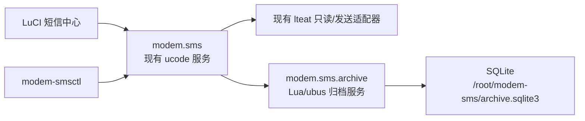

# 短信中心 Stage A（r7）实施级 PRD

版本：1.1（双重独立对抗性审计修订）

日期：2026-07-31

关联主 PRD：`PRD.md` 1.6

关联总规格：`docs/prd-sms-local-archive-batch-management-2026-07-31.md` 0.5

基线：目标机已验收 `modem-smsd/luci-app-modem-sms 0.1.0-r6`

状态：开发候选；未通过本文件发布门禁前不得安装为正式功能版本

## 1. 决策摘要

r7 只交付 Stage A，并分两个独立启用点：

- A0：本地持久归档基础、`LOCAL` 分页/搜索、容量门禁、一致性校验、外部备份/
  恢复和 sysupgrade 保留；不接受生产短信复制。
- A1：A0 门禁全部通过后，开放带持久请求状态和强来源复核的单条复制。

r7 不交付批量任务、全选、移动、设备删除或本地永久删除。

该边界是安全约束，不是 UI 暂缓：

- r6 的旧 `delete` 兼容方法继续固定返回 `DEVICE_DELETE_DISABLED`；
- 后端适配器继续声明 `features.delete=false`；
- rpcd ACL、LuCI 和 CLI 均不得出现设备删除入口；
- r7 不链接、不调用 `lteat.del_sms`，不增加其他模组写路径；
- A0 默认 `archive_enabled=0`、`archive_copy_enabled=0`；A1 只能由部署门禁显式
  启用 `archive_copy_enabled=1`；
- “移动到短信中心”、批量复制/选择在 Stage B/C 分别通过门禁后开放。

## 2. 用户价值

管理员可以：

1. 把当前 `SM/ME` 中的一条短信复制到插件自己的持久存储；
2. 在模组不可用或冷扫描尚未完成时独立浏览 `LOCAL`；
3. 默认每页查看 10 条，并切换 10、20、50、100 条；
4. 按时间、方向、原来源、号码和正文关键词搜索本地归档；
5. 验证归档健康状态，并把一致性备份直接写到显式外部挂载路径；
6. 升级、降级、卸载后保留归档数据。

## 3. r7 范围

### 3.1 必须交付

- root 专用持久目录 `/root/modem-sms`，权限 `0700`；
- SQLite 数据库 `/root/modem-sms/archive.sqlite3`，权限 `0600`；
- 版本化 schema、启动完整性检查和失败关闭；
- A1 单条复制：持久 `request_id`、可查询状态、强来源实例和内容摘要幂等；
- 原始 PDU 逐字节保存于受限数据库，普通 RPC 永不返回；
- `LOCAL` cursor 分页、详情、筛选和搜索；
- 页大小默认 10，可选 10/20/50/100，浏览器记忆设置；
- 6 MiB 默认持久文件预算、8 MiB 绝对上限、12 MiB overlay 安全余量；
- 备份、校验、恢复 CLI；备份直接写外部路径，不在 overlay 生成第二份正文库；
- `/lib/upgrade/keep.d/modem-sms`；
- 能力协商、独立 ACL、中文/英文 UI 状态；
- 单元、集成、容量、权限、升级/回滚和真机测试。

### 3.2 明确不交付

- 当前页全选、全部筛选结果和 `selection_token`；
- 批量复制和异步父/子任务；
- 移动到短信中心；
- 仅设备、仅本地、设备和本地删除；
- 回收站与永久清理；
- 自动归档、自动清理、云同步、导出、Webhook 或邮件转发；
- 任何真实短信发送或删除作为 r7 存储验收的一部分。

## 4. 现场约束与空间预算

2026-07-31 只读核验：

- 固件：OpenWrt 25.12.5，`aarch64_cortex-a53`；
- overlay：UBIFS，总计 47,592 KiB，已用 20,400 KiB，可用 24,724 KiB；
- 目标机未安装 SQLite CLI 或 SQLite 绑定；
- 软件源提供 `libsqlite3-0 3.53.1-r1`，安装体积约 1,068 KiB；
- 软件源提供 `lsqlite3 0.9.5-r1`，安装体积约 44 KiB；
- 目标机已经安装 Lua 5.1、`libubus-lua` 和 ucode 运行环境。

r7 默认：

| 项目 | 门槛 |
|---|---:|
| `archive_max_bytes` | 6,291,456 bytes |
| 产品绝对上限 | 8,388,608 bytes |
| `archive_min_free_bytes` | 12,582,912 bytes |
| `archive_max_messages` | 5,000 |
| 单条原始 PDU 总输入上限 | 64 KiB |
| 正文 UTF-8 上限 | 64 KiB |

持久文件预算必须包含数据库、`-wal`/`-shm` 或 journal、manifest、恢复状态和临时事务
峰值。每次写前使用目标文件所在文件系统的可用空间，而不是固定假设 `/overlay`。
只有预计写后仍满足 12 MiB 余量且持久文件总量不超过配置上限时才允许复制。

## 5. 技术架构



### 5.1 进程与权限

- `modem-sms-archived` 是 SQLite 的唯一写进程。
- 归档服务只接受现有 `modem-smsd` 代理的受控请求；LuCI ACL 不直接授权
  `modem.sms.archive`。
- LuCI 和 SSH CLI 继续只调用 `modem.sms`。
- 归档服务不依赖、不调用 `lteat`，没有发送或删除能力。
- 两个进程由 procd 独立监督；归档服务未就绪时现有读取/发送功能继续可用，
  归档能力返回 `available:false`。

### 5.2 SQLite 设置

r7 技术设计默认：

- `journal_mode=WAL` 仅在目标 UBIFS 实测锁、checkpoint 和空间峰值通过后使用；
  否则回退 `journal_mode=DELETE`；
- `synchronous=FULL`；
- `foreign_keys=ON`；
- `busy_timeout=2000`；
- `page_size=4096`，新库主文件 `max_page_count=1280`（5 MiB）；
- `wal_autocheckpoint=64`，`journal_size_limit=524288`；每次写前要求
  `wal_checkpoint(TRUNCATE)` 成功且没有被长读事务阻塞；
- 写事务使用 `BEGIN IMMEDIATE`；
- 所有外部输入使用绑定参数；
- schema 迁移和完整性检查由归档服务执行，不调用 shell 拼接 SQL；
- 返回复制成功前执行事务提交、checkpoint/同步屏障、重新读取和 SHA-256 比对。

每次写入的确定门禁顺序：

1. 关闭已完成的分页 statement，拒绝存在超过 2 秒的读事务；
2. checkpoint/truncate 后统计主库、WAL、SHM、manifest 和恢复状态实际字节；
3. 以“输入 PDU/正文/索引实际字节的 2 倍 + 262,144 bytes”作为本次事务峰值保守
   预算，单次预算硬上限 524,288 bytes；
4. 要求持久文件实际字节 + 峰值预算 ≤ `archive_max_bytes`；
5. 要求文件系统可用字节 - 峰值预算 ≥ `archive_min_free_bytes`；
6. 提交后重新统计；超过任一门槛时立即停止后续写入、保持数据库可读并返回
   `ARCHIVE_CAPACITY_INVARIANT_BROKEN`，不得借清理私人短信自行恢复。

若真实 UBIFS/WAL 测试证明上述峰值公式不足，必须提高预算或降低主库上限；不得只
调整测试数据使其通过。

若 Lua/SQLite 绑定无法证明以上语义，r7 保持 `archive.available=false`，不得退化为
无上限 JSON 文件或 shell SQL。

## 6. 数据模型

### 6.1 `metadata`

- `schema_version`
- `created_at`
- `last_migrated_at`
- `snapshot_version`
- `recovery_incomplete`
- `last_integrity_check_at`
- `last_backup_manifest_sha256`

### 6.2 `copy_requests`

- `request_id`：调用方生成的 UUID；
- `request_namespace`：创建时的当前 128-bit 随机命名空间；
- `job_id`：服务端生成的随机 128-bit ID；
- `authenticated_principal`：接受请求时的 ubus/rpcd 主体；
- `request_digest`：服务端对认证主体、操作和强来源成员规范序列化后计算；
- `state`：`accepted|refreshing|validating|archiving|completed|failed|unknown`；
- `worker_generation`、`claimed_at`：接受该请求的 daemon 运行代次和领取时间；
- `selected_source_token`、`resolved_source_identity_digest`；
- `archive_id`、`error_code`；
- `created_at`、`updated_at`、`completed_at`。

`request_id` 接受成功前必须与命名空间、`job_id` 和服务端摘要一起持久化。幂等键为
`(authenticated_principal, request_namespace, request_id)`。相同键和摘要返回原
状态；摘要不同返回 `REQUEST_ID_CONFLICT`。历史不得自动淘汰；
达到上限时 A1 失败关闭。r7 不引入父/子任务、选择集合、排除项或设备删除墓碑。

归档服务持久保存当前和退役命名空间。恢复前必须轮换当前命名空间；旧命名空间拒绝
新建，但原主体可查询既有请求。前向合并遇到同一幂等键不同摘要时保持两边证据、
设置 `recovery_incomplete=true` 并拒绝 A1，不静默选择一方。

### 6.3 单条任务重启恢复

- daemon 每次启动生成新的 `worker_generation`，启动后扫描所有非终态请求；
- `accepted/refreshing/validating` 属于尚未提交归档的可逆阶段；旧 worker 的这些
  请求统一终态化为 `failed/SOURCE_CONTINUITY_LOST`，不在新 epoch 自动重跑；
- 归档服务以一个 SQLite 事务写入 `messages`、全部 `message_sources`，并把对应
  `copy_requests` 从 `validating` 原子更新为 `completed`；不得出现“归档已提交但
  请求仍是 archiving”的正常提交边界；
- `archiving` 只可作为当前进程内展示态。若数据库中出现该状态，视为旧实现、
  数据损坏或事务边界违反，转为 `unknown/STATE_RECONCILIATION_REQUIRED`；
- SQLite 事务提交失败时不插入部分归档，请求保持可证明的失败状态；
- 数据库不可读、完整性失败或无法判断原子事务结果时标记 `unknown`，设置
  `recovery_incomplete=true`，A1 全局失败关闭；
- `archive_copy_status` 对所有终态持续可查，不自动重建或重试请求。

### 6.4 `messages`

- `archive_id`：随机 128-bit ID；
- `source_identity_digest`：强来源实例摘要；
- `content_digest`：规范归档内容 SHA-256；
- `direction`、`number`、`body`、`message_time`、`encoding`；
- `segments_expected`、`segments_received`、`complete`；
- `archive_quality`：`lossless|incomplete|rendered`；
- `association_trust`：`trusted|ambiguous|unknown`；
- `lossless_archivable`；
- `original_source`；
- `first_archived_at`、`updated_at`；
- `deleted_at`：r7 恒为 `NULL`，保留迁移字段。

`UNIQUE(source_identity_digest, content_digest)` 保证复制幂等。同一物理索引内容变化
必须创建新记录，不覆盖历史归档。

### 6.5 `message_sources`

- `archive_id`；
- `storage`、`storage_index`；
- `scan_epoch`、`source_generation`；
- `raw_pdu`；
- `raw_pdu_sha256`；
- `first_seen_at`、`last_seen_at`。

原始 PDU 不出现在普通分页、详情、日志、审计或诊断响应中。关联歧义、重复分片号、
分片总数冲突、解码失败或不完整记录必须是 `association_trust!=trusted`、
`lossless_archivable=false`；后续迁移不得仅因重新解码而静默升级为可移动归档。

## 7. 来源身份与 A1 单条复制

### 7.1 前置条件

- `archive_enabled=true` 且归档服务健康；
- `archive_copy_enabled=true`；
- `recovery_incomplete=false`；
- `SM/ME` 缓存已完成一次成功扫描；
- 目标消息来自 `SM` 或 `ME`；
- 客户端提交当前 `id`、`fingerprint`、`source_token`、当前
  `request_namespace` 和预先保存的 `request_id`；
- daemon 内部保留该逻辑短信全部物理分片的原始 PDU；
- 所有输入通过长度、类型和 UTF-8 校验；
- 容量预测通过。

未满足时分别返回 `ARCHIVE_DISABLED`、`ARCHIVE_UNAVAILABLE`、
`SOURCE_NOT_LOADED`、`MESSAGE_CHANGED`、`REQUEST_ID_CONFLICT` 或
`ARCHIVE_FULL`。

`archive_copy` 在 1 秒内持久化请求并返回 `request_namespace`、`request_id`、
`job_id` 与当前状态，
不等待模组。后台最小单条任务通过现有单一模组操作队列重新扫描目标来源、复核强
身份，再写入归档。23–44 秒的刷新通过 `archive_copy_status` 查询，不占用 LuCI
写 RPC；HTTP/浏览器断线不取消任务。r7 的 `job_id` 与单个 `request_id` 一一对应，
不引入父/子任务或批量状态机。

### 7.2 强身份

每个物理分片使用：

`algorithm_version | scan_epoch | source_generation | storage | index | raw_pdu_sha256`

生成来源实例摘要。逻辑短信摘要覆盖有序物理分片摘要。daemon 每次启动生成新的
128-bit `scan_epoch`；同一 epoch 内，相同物理位置观察到 PDU 变化时递增
`source_generation`；观察到位置消失、存储清空、记录替换或本系统引发来源写操作
时也必须递增。消失后即使同一 PDU 在同一索引重现，也属于新的 generation。

在把后端原始记录投影成公开列表前计算 SHA-256。`source_token` 是 daemon 保存的
256-bit 随机不透明句柄，不是裸摘要；服务端映射必须绑定：

- 派生后的认证主体 ID；
- API 和身份算法版本；
- 消息 ID、兼容 fingerprint；
- scan epoch、source generation、快照版本和有序物理分片摘要；
- 操作 `copy`、签发时间和 10 分钟过期时间。

token 不把 PDU 摘要或主体信息编码给客户端。不存在、篡改、跨主体交换、跨消息交换、
跨操作重放、过期或 daemon 重启后使用均返回统一 `SOURCE_TOKEN_INVALID`。逻辑消息
ID 保持兼容，`archive_copy` 以服务端 token 映射为权威选择身份。

后台刷新后必须匹配物理位置、PDU SHA-256、generation 和逻辑分片集合；daemon
重启、模组重置、来源读取失败、索引复用或成员变化均返回 `MESSAGE_CHANGED` 或
`SOURCE_CONTINUITY_LOST`，不写归档。

SHA-256 使用受控后端实现；
现有 64 位非密码学 `fingerprint` 只用于兼容 UI 的乐观并发提示，不作为未来设备
删除依据。

### 7.3 复制结果

- 首次接受：`ok:true, request_id, job_id, state:accepted`；
- 首次完成：`state:completed, archive_id, already_archived:false`；
- 同一强来源或同一持久请求重复复制：完成状态返回同一 `archive_id` 和
  `already_archived:true`；
- 复制可以为来源复核调用模组只读接口，但不修改短信记录、不调用删除、不发送短信；
- 解码失败、不完整或关联歧义的记录允许保存为 `incomplete`，但
  `lossless_archivable=false`；
- 页面明确显示“已复制；设备原短信仍保留”。

## 8. API

现有 `modem.sms` 增加：

| 方法 | 输入 | 输出 |
|---|---|---|
| `archive_capabilities` | 无 | 健康、schema、预算、计数、可用空间、错误码 |
| `archive_copy` | `id,fingerprint,source_token,request_namespace,request_id` | `request_namespace,request_id,job_id,state,request_digest` |
| `archive_copy_status` | `request_namespace,request_id` 或 `job_id` | `state,archive_id,error_code,already_archived` |
| `messages_page` | `source=LOCAL,box,query,query_fields,cursor,limit,sort` | page 响应 |
| `archive_get` | `archive_id` | 完整号码/正文与规范元数据，不含原始 PDU |
| `archive_verify` | 无 | 完整性、计数、持久文件字节和恢复状态 |

`messages_page` 在 r7 只接受 `source=LOCAL`。`SM/ME/ALL` 继续使用现有 `list`，
统一跨来源 cursor 留到 Stage B，避免把未经物化的设备选择误认为批量能力。

分页响应：

- `items`
- `next_cursor`
- `page_size`
- `filtered_count`
- `snapshot_version`

cursor 为绑定排序、筛选摘要、末项键、snapshot 和过期时间的服务端认证不透明令牌。
实现使用服务端 256-bit 随机句柄和有界内存映射，绑定派生主体 ID、API 版本、
排序、筛选摘要、末项、`messages_snapshot_version` 和过期时间，不在客户端编码
排序键。只有 `messages/message_sources` 的可见集合变化才递增该版本；任务状态变化
不使分页失效。daemon/归档服务重启、未知句柄或版本变化统一返回 `CURSOR_STALE`。
r7 不提供 `prev_cursor`；前端保存已访问页的 cursor 栈实现返回上一页。数据变化返回
`CURSOR_STALE` 并回到第一页。

页大小仅允许 10、20、50、100；缺失或非法值回退 10。关键词最长 256 UTF-8 字节，
不进入 URL、日志或审计。

只有元数据读取权限时，`items` 不含正文预览，正文/号码搜索统一返回
`PERMISSION_DENIED`；同时具有正文读取权限时才返回脱敏号码与正文摘要。权限差异
不得通过命中计数、排序、错误细节或显著耗时形成内容探测 oracle。

## 9. UI

- 新增来源标签：“设备短信”“本地归档”；
- 设备列表每条可归档记录提供“复制到短信中心”；
- 复制前显示脱敏号码、摘要和“不会删除设备原短信”；
- 点击确认前生成并保存独立 `request_id`；响应丢失只查询原请求，不生成新 ID；
- 客户端同时保存提交前取得的 `request_namespace`；
- A1 显示“刷新来源、校验、归档、完成/失败/未知”状态；
- `LOCAL` 默认每页 10 条，可选 10/20/50/100；
- 每页数量保存在 `localStorage` 独立键中，非法值自动清除；
- `LOCAL` 首屏不等待模组扫描；
- 展示归档时间、原来源、完整度和归档质量；
- 不显示移动、删除、批量操作或全选控件；
- `ARCHIVE_UNAVAILABLE` 与 `SERVICE_UNAVAILABLE` 分开呈现；
- transport timeout 显示“结果待确认”，随后使用原 `request_id` 查询；
- A0 或 A1 门禁未打开时隐藏复制按钮，并显示可操作的能力原因。

## 10. 备份、恢复与升级

### 10.1 备份

root CLI：

```text
modem-smsctl archive-backup --output /mnt/<external>/modem-sms-<time>.sqlite3 --json
modem-smsctl archive-verify --json
```

- 输出路径必须是显式绝对路径，使用 `realpath` 解析现有父目录；
- 默认拒绝 `/`, `/overlay`, `/root`, `/etc`, `/tmp`, `/var` 及归档目录；
- 拒绝路径任一分量和最终目标为符号链接，使用 `O_NOFOLLOW|O_CREAT|O_EXCL` 打开；
- 从 `/proc/self/mountinfo` 记录并比较 mount ID，确认目标与归档库不在同一挂载；
- 文件打开后通过 fd 再次复核真实路径、设备号和 mount ID，防止 TOCTOU 或 bind
  mount 交换；不满足时删除尚未写入正文的空目标并失败关闭；
- 使用 SQLite backup API 或受锁定只读快照直接写目标；
- 同目录生成 manifest 与 SHA-256；
- manifest 不含正文、号码或 PDU；
- 日志只记录目标挂载点、字节数和摘要。

### 10.2 恢复

root CLI：

```text
modem-smsctl archive-restore --input /mnt/<external>/backup.sqlite3 \
  --manifest /mnt/<external>/backup.manifest.json --confirm --json
```

- 校验 manifest、SHA-256、schema 和 `integrity_check`；
- 恢复必须通过唯一写进程的维护 API 执行；获取全局维护锁、停止新归档写入并关闭
  所有普通 SQLite statement/连接后才可替换或前向合并；
- r7 只允许恢复到空库，或按 `source_identity_digest + content_digest` 前向合并；
- 不用旧备份覆盖当前新记录；
- 恢复开始前耐久轮换 `request_namespace`；中断时保留原库，设置
  `recovery_incomplete=true`；
- 恢复完成后重新打开数据库并全量校验。

### 10.3 包与 sysupgrade

- 包安装、升级、降级、卸载不得删除 `/root/modem-sms`；
- `keep.d` 明确保留 `/root/modem-sms/`；
- sysupgrade 前冻结、checkpoint、目录同步和完整性检查失败时返回
  `UPGRADE_SNAPSHOT_FAILED`；
- r7 必须在目标固件可靠挂接“失败即中止升级”的钩子；无法中止时 A0/A1 均不得
  作为正式功能版本发布。外部一致性备份是额外保护，不替代冻结后的 sysupgrade
  快照；
- 降级到 r6 时 r6 忽略但保留归档目录，不尝试解析或删除数据库。

## 11. ACL 与隐私

rpcd 分离：

- `archive_capabilities`、脱敏 `messages_page`：归档元数据读取；
- `archive_get`：归档正文读取；
- `archive_copy`：归档写；
- `archive_copy_status`：仅原认证主体可读的任务状态；
- `archive_verify`：管理员诊断。

r7 不增加设备删除和永久清理 ACL。归档数据库、备份和恢复包含私人短信正文与号码，
部署和 UI 必须明确提示敏感性。任何日志、普通状态和 manifest 均不得包含正文、
完整号码或原始 PDU。

`modem-smsd` 从有效 `ubus_rpc_session` 派生主体 ID：使用进程随机盐进行 SHA-256，
不落盘原 session。没有 session 的本地 ubus 调用只在 Unix ubus socket 的 root
访问边界内映射为固定 `local-root`。归档服务不自行信任客户端主体字段，只接受
`modem-smsd` 通过私有高熵启动 nonce 委托的派生主体；nonce 不写日志、UI 或数据库。
若当前 libubus/ucode 无法证明代理调用和本地 root 边界，A1 不启用。

## 12. 错误码

r7 至少稳定：

- `ARCHIVE_DISABLED`
- `ARCHIVE_UNAVAILABLE`
- `ARCHIVE_FULL`
- `ARCHIVE_WRITE_FAILED`
- `ARCHIVE_VERIFY_FAILED`
- `ARCHIVE_SCHEMA_UNSUPPORTED`
- `SOURCE_NOT_LOADED`
- `SOURCE_SNAPSHOT_STALE`
- `SOURCE_TOKEN_INVALID`
- `MESSAGE_CHANGED`
- `SOURCE_CONTINUITY_LOST`
- `REQUEST_ID_CONFLICT`
- `IDEMPOTENCY_HISTORY_FULL`
- `CURSOR_INVALID`
- `CURSOR_STALE`
- `QUERY_LIMIT_EXCEEDED`
- `PERMISSION_DENIED`
- `RECOVERY_INCOMPLETE`
- `BACKUP_TARGET_UNSAFE`
- `BACKUP_VERIFY_FAILED`
- `RESTORE_CONFLICT`
- `UPGRADE_SNAPSHOT_FAILED`
- `STATE_RECONCILIATION_REQUIRED`

`DEVICE_DELETE_DISABLED` 保持不变。

## 13. 验收门禁

### 13.1 源码与离线

1. schema 创建、迁移、幂等复制、索引复用、不完整短信、搜索和 cursor 测试通过；
2. 复制写失败、磁盘满、数据库损坏、服务重启时设备删除调用次数恒为零；
3. 原始 PDU 在数据库中逐字节一致，普通 RPC/日志无法读取；
4. 5000 条固定数据集下，10/20/50/100 页 P95 ≤ 1 秒；
5. 本地第一页 10 条 P95 ≤ 500 ms；
6. 数据库及附属文件不超过配置预算，预计写后保留 12 MiB；
7. SQLite、Lua 绑定和包依赖通过目标 SDK 构建、`apk verify`、`adbdump` 和解包；
8. r6 读取、发送幂等、冷 `summary` 和 13 项 daemon 集成回归不退化；
9. 静态断言确认 daemon/CLI/ACL/LuCI 无设备删除和移动入口。
10. A0 在空库上完成分页、搜索、备份、恢复和生命周期测试后才允许启用；
11. A1 覆盖创建响应丢失、相同请求重放、请求摘要冲突、daemon/模组重启、索引
    复用、无 SCTS 发件记录、解码失败和来源读取失败；
12. 后端缺少 `del_sms` 时读取、发送、A0 和 A1 仍按各自能力工作，设备删除保持
    `false`；后端可用性不得再把禁用的删除方法列为前置条件。
13. 在请求行提交前/后、消息事务提交前/后、checkpoint 前/后和
    `completed` 可见前/后强杀进程；在专用测试机执行等价强制断电，恢复后不存在
    “已报告完成但正文丢失”、部分 message_sources 或永久非终态任务；
14. cursor/source token 覆盖篡改、跨主体/消息/操作交换、过期、服务重启和版本
    变化；所有失败均不泄露内部摘要；
15. sysupgrade 冻结、checkpoint、目录同步或校验故障注入必须实际中止升级。

5000 条固定数据集至少包含：70% 单段、20% 2–3 段、9% 4–20 段、1% 接近允许
单条上限的记录；GSM7/UCS2/8-bit/解码失败/重复时间戳/无时间记录均覆盖。若该分布
不能同时装入 6 MiB，容量门禁优先，验收记录实际可容纳条数，不得声称“5000 条容量”
与“5000 条性能”同时成立。

### 13.2 真机

1. 安装前创建外部回滚包和配置备份；
2. 首次安装默认 `archive_enabled=0`，现有 r6 行为不变；
3. 先启用 A0 并完成空库门禁，再单独启用 A1；只复制用户指定的测试短信，不读取
   或导出其他私人短信正文；
4. 复制前后 `SM/ME` 数量、索引、容量和缓存来源身份不变；
5. 重启归档服务、短信服务和设备后，测试归档仍可读取；
6. 数据库权限、目录权限、overlay 预算和 UBIFS 模式符合要求；
7. 外部备份、SHA-256、恢复到隔离测试库和前向合并通过；
8. 包升级、降级到 r6、再升级 r7 后归档不丢失；
9. sysupgrade 冻结、checkpoint、目录同步和校验成功路径实测；故障注入时升级被
   实际中止。外部一致性备份只作为附加保护，不替代该门禁；
10. `usb0` 地址、默认路由和数据业务不变化；
11. 固定不存在 ID 的旧删除探针仍返回 `DEVICE_DELETE_DISABLED`，且模组删除调用为零；
12. LuCI 登录后的 `LOCAL` 分页、页大小记忆、详情与错误状态完成视觉验收。

任一门禁失败：r7 不部署或立即回滚；归档目录保留供只读取证，设备删除继续禁用。

## 14. 后续版本

- Stage B：多选、当前页全选、全部筛选结果、不可变 `selection_token`、批量复制、
  异步任务和进度恢复；仍不删除设备短信。
- Stage C：仅在无损归档、强来源连续性、掉电恢复、pin、幂等墓碑和全局 CPMS
  唯一所有者全部通过后，才评估移动和设备删除。

## 15. 对抗性审计修订记录

两位独立 agent 的首轮审计共同确认下一版只能为 Stage A，并据此：

1. 拆分 A0 存储门禁与 A1 单条复制启用点；
2. 把单条复制改为持久 `request_namespace/request_id/job_id` 最小任务；
3. 增加 worker generation、非终态重启收敛和归档/请求原子事务；
4. 把 `source_token` 改为绑定主体、操作、版本、epoch、generation、分片和过期
   时间的服务端随机不透明句柄；
5. 明确位置消失、清空、替换和同 PDU 重现都递增 generation；
6. 增加代理主体派生、私有委托 nonce 和跨主体状态隔离门禁；
7. 恢复轮换请求命名空间，冲突时失败关闭；
8. 取消 sysupgrade 文档降级方案，冻结/checkpoint/目录同步/校验和中止能力改为
   A0/A1 发布硬门禁；
9. 收紧 SQLite 主库/WAL/事务峰值、写前写后空间算法和故障注入；
10. 备份路径加入 realpath、symlink、mount ID、fd 复核和 TOCTOU 门禁；
11. LOCAL cursor 绑定主体/API/消息快照，并与任务状态版本分离；
12. 后端缺少删除方法时不得连带禁用读取、发送或归档。
